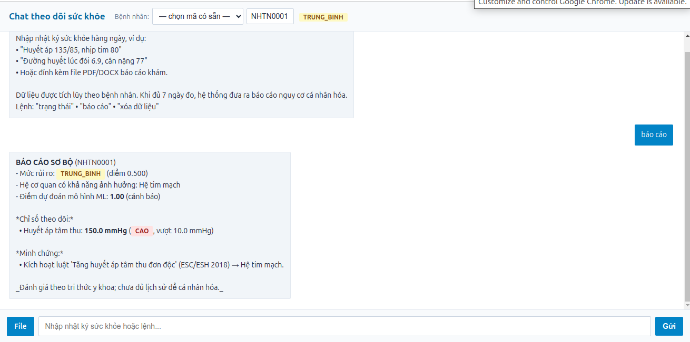
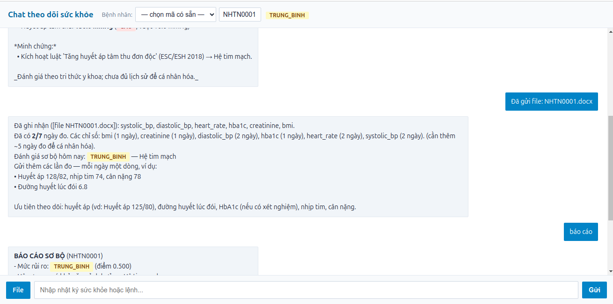

# Hệ thống cảnh báo sớm nguy cơ sức khỏe dựa trên phân tích chuỗi thời gian cá nhân hóa

## Đội ngũ thực hiện

| Thành viên | Vai trò |
|------------|---------|
| Nguyễn Đức Cảnh | Trưởng nhóm — Chủ trì toàn bộ phát triển code |
| Nguyễn Khắc Nam Khánh | Nghiên cứu, tổng hợp và viết báo cáo |
| Vũ Đình An | Nghiên cứu, tổng hợp và viết báo cáo |

## Mục lục tài liệu

- [01. Tổng hợp nghiên cứu (5 bài báo)](docs/01_Tong_hop_nghien_cuu.md)
- [02. Kế hoạch dự án](docs/02_Ke_hoach_du_an.md)
- [03. Thiết kế hệ thống 3 tầng](docs/03_Thiet_ke_he_thong.md)
- [04. Lựa chọn & so sánh mô hình](docs/04_Lua_chon_mo_hinh.md)
- [05. Nâng cấp mô hình & Mô hình con trích xuất dữ liệu](docs/05_Mo_hinh_nang_cap_va_ingest.md)
- [06. Báo cáo huấn luyện: kết quả, giới hạn, hướng chuẩn mực hóa](docs/06_Bao_cao_huong_train_va_gioi_han.md)
- [07. Định vị đề tài: Khung hỗ trợ quyết định lâm sàng](docs/07_Dinh_vi_de_tai.md)
- [08. Nguồn tri thức y khoa và xây dựng luật](docs/08_Nguon_tri_thuc_va_xay_dung_luat.md)
- [09. Thảo luận & chuẩn hóa định vị đề tài (nội bộ)](docs/09_Thao_luan_chuan_hoa_dinh_vi.md)

## Kiến trúc 3 tầng

```
Tầng 1  Phân tích bất thường & xu hướng cá nhân (Z-Score, Isolation Forest, EWMA/STL,
        sai số dự báo chuỗi thời gian — EWMA offline, sẵn sàng Chronos/TimesFM)
Tầng 2  Ánh xạ tri thức y khoa (rule engine trên JSON)
Tầng 3  Tổng hợp rủi ro & hỗ trợ quyết định (LightGBM + SHAP + báo cáo chi tiết từng chỉ số)
```

Mô hình ML hiện tại: LightGBM được huấn luyện trên **dữ liệu thật NHANES 2017-2018
(CDC)** — 4949 người, nhãn tăng huyết áp/đái tháo đường (AUC 5-fold 0.9436) — và
được đối chứng trên Pima Diabetes (AUC 0.8116) và Cleveland Heart Disease (AUC
0.8906). Chi tiết kết quả, giới hạn và lộ trình: [docs/06](docs/06_Bao_cao_huong_train_va_gioi_han.md).

> **Định vị:** đề tài xây dựng một **khung hỗ trợ quyết định lâm sàng** (CDSF),
> không xây dựng một mô hình AI mới. Mô hình học máy (LightGBM) là một thành phần
> có thể thay thế trong khung. Chi tiết: [docs/07](docs/07_Dinh_vi_de_tai.md).

## Cài đặt

```bash
pip install -r requirements.txt
```

## Vận hành

```bash
./run_api.sh start        # khởi động API + hộp thoại chat (http://127.0.0.1:8000)
python -m src.main --input <file.csv> --output report/
```

## Giao diện & cách dùng ứng dụng

Sau khi chạy `./run_api.sh start`, mở trình duyệt tại **http://127.0.0.1:8000/chat**.

| Hộp thoại chat | Kết quả đánh giá |
|---|---|
|  |  |
**Cách dùng:**

1. Chọn hoặc nhập **mã bệnh nhân** ở góc trên (thanh xổ liệt kê các mã đã có dữ liệu trong `data/chat/`).
2. Nhập nhật ký sức khỏe hàng ngày — mỗi ngày một dòng, ví dụ:
   - `Huyết áp 135/85, nhịp tim 80`
   - `Đường huyết lúc đói 6.9, cân nặng 77`
   - Hoặc **đính kèm file PDF/DOCX** báo cáo khám (đọc được cả báo cáo thật xuất từ NHANES trong `data/sample_nhanes/`).
3. Dữ liệu được tích lũy theo bệnh nhân; khi đủ 7 ngày đo, hệ thống đưa ra **báo cáo nguy cơ cá nhân hóa**.
4. Lệnh điều khiển: `trạng thái` (tình trạng hiện tại), `báo cáo` (đánh giá đầy đủ), `xóa dữ liệu` (reset bệnh nhân).

Kết quả đánh giá được trình bày theo thứ tự: **luật lâm sàng kích hoạt** (mỗi luật kèm link tham chiếu nguồn hướng dẫn gốc, thêm số trang/chương/trích đoạn nếu có), **bảng chỉ số theo dõi** (giá trị, đường cơ sở, thay đổi, xu hướng, Z-Score, phạm vi bình thường), rồi mới đến **hỗ trợ của mô hình ML** kèm ghi chú rõ đây là suy luận bổ sung, không phải chẩn đoán chính thức — kết luận cuối do bác sĩ xác nhận. Kết quả đủ thông tin để bệnh nhân trình bác sĩ.

### Quản lý cơ sở tri thức (`/rules`)

Trang **http://127.0.0.1:8000/rules** dành cho bác sĩ: xem danh sách luật theo hệ cơ quan, **thêm/sửa/xóa luật** (nhập điều kiện chỉ số ghép AND/OR, độ nặng, chuyên khoa, link nguồn kèm số trang/chương/trích đoạn), **thêm hệ cơ quan mới** và **thêm chỉ số mới** — cơ sở tri thức mở rộng được mà không cần sửa code. Mọi thay đổi được validate trước khi ghi (sai cấu trúc, sai toán tử, độ nặng ngoài 0–1, link không hợp lệ đều bị từ chối kèm thông báo). Chi tiết: [docs/08](docs/08_Nguon_tri_thuc_va_xay_dung_luat.md).

API đầy đủ: **http://127.0.0.1:8000/docs** (Swagger).

## Huấn luyện mô hình

```bash
python scripts/build_nhanes_dataset.py   # dựng dataset thật NHANES (CDC)
python scripts/train_nhanes.py           # train model sản xuất trên NHANES
python scripts/download_datasets.py      # tải dataset chính thống (UCI)
python scripts/train_real_datasets.py    # đánh giá trên dữ liệu thật UCI
```

## Schema dữ liệu đầu vào

```csv
patient_id,timestamp,metric,value
P001,2025-01-01,systolic_bp,128
P001,2025-01-01,diastolic_bp,82
P001,2025-01-02,systolic_bp,131
```

## Cấu trúc mã nguồn

```
src/
  config.py                 # tham số toàn cục
  main.py                   # pipeline chính
  api.py                    # API FastAPI
  data/                     # nạp, làm sạch, đặc trưng hóa
  tier1_anomaly/            # phát hiện bất thường cá nhân hóa
  tier2_knowledge/          # cơ sở tri thức y khoa (JSON + rule engine)
  tier3_risk/               # điểm rủi ro + báo cáo
  models/                   # LightGBM, SHAP, LSTM (đối chứng)
  ingest/                   # trích xuất dữ liệu từ PDF/DOCX
  chat/                     # hộp thoại tích lũy nhật ký sức khỏe
```
