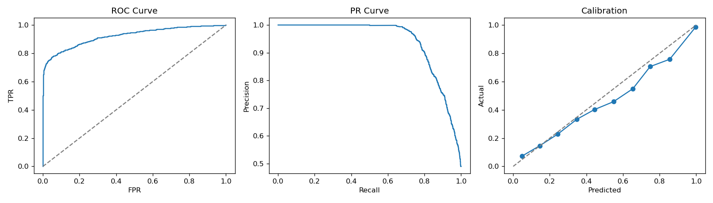
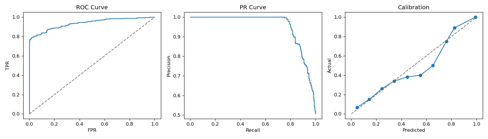
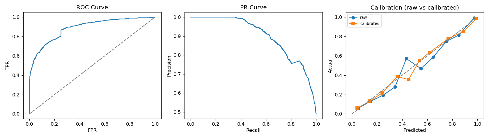
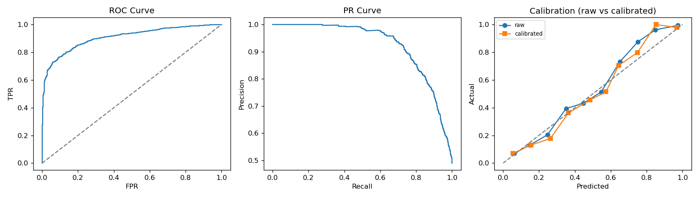
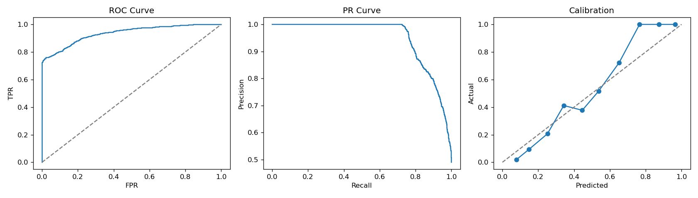
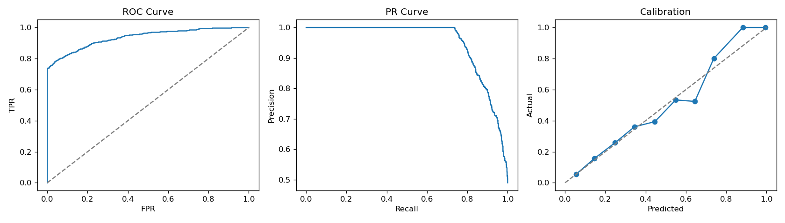

# 11. Kết quả benchmark lần 1 — Baseline 6 mô hình và đánh giá luận giải

> Báo cáo này ghi lại kết quả thực nghiệm đầu tiên của khung: so sánh 6 mô hình học máy
> trên cùng một bộ dữ liệu, kèm đánh giá **tính hợp lý lâm sàng** (clinical
> plausibility) và **độ trung thực của luận giải** (explainability fidelity)
> trên một ca cụ thể. Mọi số liệu truy xuất từ evidence package
> (`experiments/EXP-ML-<MODEL>-<SEED>/`) theo Experimental Protocol (`notes/02`).
> Nội dung nêu đúng những gì đo được, không thổi phồng, và nêu thẳng giới hạn
> ở từng bước.

---

## 1. Chạy thực nghiệm nào

| Thành phần | Giá trị |
|---|---|
| Dataset | `data/datasets/nhanes_2017_2018.csv` (NHANES CDC) |
| Số mẫu | 4.949, positive = 2.503 (~50,6%) |
| Target | `label` — nguy cơ tăng huyết áp hoặc đái tháo đường |
| Đặc trưng | 7 chỉ số lâm sàng: systolic_bp, diastolic_bp, heart_rate, glucose_fasting, hba1c, creatinine, bmi |
| Split | 70 / 15 / 15 (train / val / test), test khóa lại |
| Seeds | 42, 52, 62, 72, 82 → báo mean ± std |
| Preprocessing | Imputer median fit trên train (tránh data leakage) |
| Metrics | ROC-AUC, PR-AUC, Accuracy, Precision, Recall, Specificity, F1, Brier |
| Code | `src/experiments/`, CLI `scripts/run_benchmark.py` |

## 2. Kết quả tổng hợp (test set, mean ± std, 5 seed)

| Mô hình | Họ | ROC-AUC | PR-AUC | Accuracy | Precision | Recall | Specificity | F1 | Brier |
|---|---|---|---|---|---|---|---|---|---|
| **XGBoost** | Gradient boosting | **0.946±0.005** | **0.960±0.004** | 0.882±0.008 | 0.939±0.009 | **0.820±0.013** | 0.946±0.009 | 0.876±0.009 | 0.083±0.004 |
| **Random Forest** | Tree ensemble | 0.945±0.006 | 0.959±0.004 | 0.883±0.004 | **0.967±0.009** | 0.797±0.008 | **0.972±0.008** | 0.874±0.004 | 0.086±0.003 |
| **LightGBM** | Gradient boosting | 0.945±0.006 | 0.959±0.004 | **0.887±0.006** | 0.953±0.009 | 0.819±0.011 | 0.958±0.009 | **0.880±0.007** | **0.082±0.004** |
| **FT-Transformer** | Transformer tabular | 0.933±0.008 | 0.949±0.005 | 0.864±0.010 | 0.903±0.023 | 0.819±0.013 | 0.909±0.025 | 0.859±0.009 | 0.099±0.007 |
| **Logistic Regression** | Baseline tuyến tính | 0.918±0.008 | 0.930±0.007 | 0.822±0.012 | 0.841±0.017 | 0.798±0.011 | 0.845±0.020 | 0.819±0.011 | 0.116±0.006 |
| **MLP** | Neural network | 0.842±0.067 | 0.867±0.057 | 0.771±0.058 | 0.807±0.075 | 0.729±0.071 | 0.814±0.089 | 0.763±0.056 | 0.167±0.038 |

### Cách đọc bảng này (và giới hạn của nó)

- **XGB / LGBM / RF gần như tương đương**: chênh lệch ROC-AUC giữa các mô hình
  ≤ 0.001. Với độ lệch chuẩn ~0.005, **không thể kết luận** mô hình nào
  "hơn" mô hình nào dựa trên bảng này; nếu đưa vào báo cáo thì cần paired test
  (ví dụ so trên từng test fold giống nhau). Paired test chưa được thực hiện ở lần này.
- **MLP yếu nhất và phương sai lớn** (0.842±0.067). Điều này khớp kỳ vọng trên
  dữ liệu quy mô ~5.000 mẫu không có pretraining, nhưng cũng phải nói rõ: MLP
  **chưa được tuning** — chỉ dùng cấu hình mặc định. Kết quả này là baseline
  neural đơn giản, không phải "MLP tối ưu".
- **LR (0.918) là baseline tuyến tính**: chênh ~0.03 với nhóm boosting đủ để nói
  "mô hình phi tuyến cải thiện rõ trên bài toán này", nhưng chưa đủ để nói
  "boosting là lựa chọn duy nhất đúng".
- **Toàn bộ model đều chưa tuning hyperparameter**, trừ một vài tham số mặc định
  thay đổi nhỏ. Đây là benchmark lần 1 để lấy mốc, không phải kết quả cuối cùng.

## 3. Đánh giá luận giải trên một ca cụ thể

Đo độ chính xác chưa đủ — với hệ thống cảnh báo y tế, cần biết **lời giải
thích có hợp lý về mặt lâm sàng hay không**. Chọn một ca mẫu và chạy tất cả
mô hình với cùng đầu vào:

- Systolic BP = **165 mmHg**, Diastolic BP = **95 mmHg** (cả hai ở ngưỡng Tăng
  huyết áp Độ 2), Nhịp tim = 88, Đường huyết đói = 6.2 mmol/L, HbA1c = 6.1%,
  Creatinine = 0.9 mg/dL, BMI = 27.

Cách đo: **perturbation** — thay lần lượt từng đặc trưng bằng median quần thể,
đo độ thay đổi điểm nguy cơ → đặc trưng nào đẩy điểm lên (▲) / kéo xuống (▼).
Đây là phương pháp model-agnostic, không cần SHAP, áp dụng được cho mọi mô hình.
**Giới hạn cần nói rõ**: perturbation quanh baseline quần thể chỉ phản ánh ảnh
hưởng *cục bộ quanh điểm dữ liệu này*, không phải thuộc tính toàn cục của mô
hình; con số không tương đương với hệ số hồi quy hay SHAP value.

Ngoài luận giải theo **từng đặc trưng**, còn tính luận giải theo **từng luật
kích hoạt**: với mỗi luật, đặt đúng các chỉ số mà luật đó dùng về baseline quần
thể rồi đo độ giảm điểm nguy cơ → con số đó là "phần điểm do luật này đóng
góp". Ca mẫu trên kích hoạt 3 luật: `R_CV_01` (Tăng huyết áp), `R_CV_03` (THA
tâm thu đơn độc), `R_MET_01` (BMI thừa cân).

### 3.1. Bảng tổng hợp luận giải

| Mô hình | Điểm nguy cơ | Đặc trưng chính | Đánh giá luận giải | Vấn đề chính |
|---|---|---|---|---|
| **Random Forest** | 0.9954 | SBP ▲0.233, DBP ▲0.021 | **Tốt nhất** | Phản ánh đúng cả SBP lẫn DBP cùng chiều tăng nguy cơ |
| **Logistic Regression** | 0.9924 | SBP ▲0.324, HbA1c ▲0.009 | Khá | Bắt được HbA1c (tiền ĐTĐ nhẹ) nhưng DBP bị lấn át bởi SBP |
| **LightGBM / XGBoost** | 0.999x | SBP ▲0.04–0.07 | Trung bình | Bão hòa xác suất, triệt tiêu tín hiệu các biến phụ |
| **FT-Transformer** | 1.0000 | SBP ▲0.156 | Kém | Feature collapse, chỉ giải thích duy nhất 1 biến |
| **MLP** | 0.6929 | SBP ▲0.671, HR ▼0.279, DBP ▼0.269 | Sai lệch | Đảo chiều DBP và Nhịp tim thành yếu tố bảo vệ |

### 3.2. Phân tích chi tiết từng mô hình

**1. Random Forest — luận giải tối ưu nhất trong nhóm.**
Ca này có SBP 165 mmHg và DBP 95 mmHg, cả hai ở ngưỡng Tăng huyết áp Độ 2.
Random Forest gán trọng số dương lớn nhất cho SBP (+0.233) và tiếp tục ghi nhận
DBP đóng góp tăng nguy cơ (+0.021) — đúng chiều của tri thức y khoa. Nhờ cơ chế
chọn mẫu đặc trưng ngẫu nhiên (feature subsampling), mô hình không phụ thuộc
tuyệt đối vào một biến duy nhất mà vẫn ghi nhận được tín hiệu thứ cấp từ các cây
khác nhau. Lời giải thích vì thế cân bằng và đáng tin cậy nhất trong nhóm.

**2. Logistic Regression — tương đối tốt nhưng chịu ảnh hưởng đa cộng tuyến.**
Phản ánh đúng chiều hướng SBP (+0.324) và bắt được tín hiệu tiền đái tháo đường
nhẹ (HbA1c 6.1% → +0.009). Hạn chế: SBP và DBP có độ tương quan tuyến tính rất
cao (collinearity), khiến hệ số của DBP bị triệt tiêu gần như hoàn toàn và dồn
hết tải trọng sang SBP. Đây là hạn chế đặc trưng của mô hình tuyến tính, không
phải lỗi của riêng bản chạy này.

**3. LightGBM & XGBoost — hiện tượng bão hòa xác suất (probability saturation).**
Điểm rủi ro đạt mức cực đoan (0.9998 và 0.9995). Khi mô hình phân nhánh quá sâu
vào SBP để đẩy điểm số tiệm cận 1.0, các split sau cho DBP hay HbA1c gần như
không đóng góp thêm — hiện tượng **nén attribution (feature collapse)**, khiến
các chỉ số nguy cơ thực tế khác bị gán giá trị xấp xỉ 0.000. Cần nhấn mạnh:
đây là hạn chế của *phép giải thích gần điểm bão hòa*, không phải dấu hiệu mô
hình dự đoán sai — bản thân mô hình vẫn chính xác, nhưng lời giải thích cục bộ
không còn phân biệt được vai trò các biến.

**4. FT-Transformer — feature collapse cực đoan.**
Điểm số chạm trần tuyệt đối (1.0000), dồn toàn bộ trọng số chú ý vào SBP
(+0.156) và làm phẳng hoàn toàn các biến sinh hóa còn lại. Kết quả dự đoán cao
nhưng lời giải thích nghèo nàn. Nhận định này khớp với tài liệu chung về các mô
hình Transformer trên dữ liệu bảng quy mô nhỏ: mạnh về dự đoán, yếu về minh bạch
cục bộ. Cần lưu ý: bản FT-Transformer dùng trong đợt này là phiên bản gọn, tự cài (không
dùng torch), chưa tuning — không nên tổng quát hóa kết luận cho mọi biến thể
FT-Transformer.

**5. MLP — sai lệch bản chất sinh lý học (collinearity / gradient artifact).**
Đây là trường hợp đáng chú ý nhất: MLP gán SBP là yếu tố tăng nguy cơ cực mạnh
(+0.671) nhưng lại coi DBP 95 mmHg (−0.269) và Nhịp tim 88 (−0.279) là yếu tố
bảo vệ/giảm nguy cơ — đi ngược lại tri thức y khoa. Đây là hiện
tượng **weights cancellation** kinh điển trong mạng nơ-ron khi xử lý dữ liệu
bảng có hai biến tương quan thuận mạnh (SBP và DBP): một biến nhận trọng số
dương lớn, biến còn lại bị gán trọng số âm để bù trừ. **Mức độ chắc chắn của
giải thích này ở mức trung bình** — kiến trúc MLP chưa được phân tích sâu, nên
đây là giả thuyết hợp lý chứ không phải kết luận đã chứng minh.

### 3.3. Nhận xét rút ra

1. **Độ chính xác cao không đồng nghĩa lời giải thích trung thực.** XGB / LGBM /
   FT-Transformer đứng đầu về AUC nhưng luận giải bị bão hòa/collapse; Random
   Forest xếp thứ 2 về AUC nhưng cho luận giải chuẩn xác và đáng tin cậy nhất
   trong nhóm.
2. **Điểm theo từng luật cho thấy cùng kết luận.** Với ca mẫu, nhóm tree/boosting
   gán R_CV_01 (Tăng huyết áp) đóng góp ~0.6–0.7 — đúng vai trò của luật chính;
   riêng MLP đảo lạ (R_CV_03 +0.67, R_MET_01 âm) — lặp lại đúng hiện tượng đảo
   chiều đã thấy ở luận giải theo đặc trưng. Đây là phép kiểm chứng chéo: hai
   cách luận giải khác nhau cùng chỉ ra MLP không đáng tin ở ca này.
3. Điều này củng cố quyết định thiết kế khung: **không chọn một mô hình làm
   "chân lý"**, mà để các nguồn bằng chứng đối chiếu nhau trong cơ chế fusion —
   khi một mô hình đưa ra lời giải thích bất thường (ví dụ DBP giảm nguy cơ),
   các nguồn khác sẽ phát hiện sự bất thường này.
4. Trong báo cáo chính thức, phần luận giải của MLP được dùng như minh chứng về
   hạn chế của neural network trên dữ liệu bảng nhỏ, **không được trình bày như
   khuyến nghị lâm sàng**.

## 4. Evidence package — truy xuất từng thí nghiệm

Mỗi lần chạy là một thư mục `experiments/EXP-ML-<MODEL>-<SEED>/` gồm:
`config.json`, `metrics.json`, `predictions.csv`, `curves.png`,
`feature_importance.csv`, `model.joblib`. Dưới đây là đồ thị ROC/PR/Calibration
của từng mô hình (seed 42, đại diện):

> Bảng chi tiết 30 thí nghiệm (6 mô hình × 5 seed) đọc tại
> `experiments/summary.csv`, tổng hợp tại `experiments/summary.md`, xem trực
> quan tại **http://127.0.0.1:8000/benchmark**.

## 5. Ghi chú chụp màn hình cho báo cáo

> Danh sách ảnh cần chụp trên giao diện `/benchmark` (mở server:
> `./run_api.sh start`, vào http://127.0.0.1:8000/benchmark). Nên chụp màn hình
> gọn, ít khoảng trống, đặt tên `benchmark_<nội dung>.png` và đưa vào
> `docs/screenshots/`.

| # | Vị trí | Nội dung cần chụp | Gợi ý đặt tên |
|---|---|---|---|
| 1 | Tab **Bảng tổng hợp** | Toàn bộ bảng 6 mô hình × 8 metric (kèm dòng meta dataset/seeds) | `benchmark_tong_hop.png` |
| 2 | Tab **So sánh luận giải** | Trạng thái sau khi bấm "So sánh luận giải" với ca SBP 165 / DBP 95 — gồm khối "Bệnh/nguy cơ lâm sàng được kích hoạt" + từng card model | `benchmark_so_sanh_luan_giai.png` |
| 3 | Tab **So sánh luận giải** | Khối "Bệnh/nguy cơ lâm sàng" (hệ tim mạch + chuyển hóa, các luật R_CV_01/R_CV_03/R_MET_01) | `benchmark_luan_giai_theo_luat.png` |
| 4 | Tab **So sánh luận giải** | Riêng thẻ Random Forest — gồm "Đóng góp theo từng luật kích hoạt" + đặc trưng chính | `benchmark_rf_luan_giai.png` |
| 5 | Tab **So sánh luận giải** | Riêng thẻ MLP (minh chứng đảo chiều DBP/HR và R_MET_01 âm) | `benchmark_mlp_sai_lech.png` |
| 6 | Tab **So sánh luận giải** | Form nhập đủ 10 chỉ số (mở rộng, có glucose/egfr/spo2) | `benchmark_form_10_chi_so.png` |
| 7 | Tab **Chi tiết thí nghiệm** | Vài evidence package tiêu biểu (XGB/LGBM/RF) có kèm curves | `benchmark_chi_tiet_thi_nghiem.png` |

## 6. Giới hạn của đợt thực nghiệm này

1. **Chưa tuning hyperparameter** cho bất kỳ mô hình nào — kết quả là mốc ban
   đầu, có thể cải thiện (đặc biệt FT-Transformer và MLP).
2. **Chưa làm paired test** giữa các mô hình — chưa thể khẳng định XGB "hơn"
   LGBM hay RF.
3. **Chỉ dùng một bộ dữ liệu** (NHANES 2017–2018). Kết quả chưa kiểm chứng chéo
   trên Pima/Cleveland đang có trong repo.
4. **Luận giải đo bằng perturbation cục bộ** — không phải SHAP/attribution toàn
   cục; kết luận về MLP (weights cancellation) ở mức giả thuyết.
5. **Ca đánh giá luận giải chỉ là một ca mẫu** — chưa phải đánh giá hệ thống
   trên nhiều ca; độ khái quát của nhận xét "RF luận giải tốt nhất" cần kiểm
   chứng thêm trước khi đưa vào báo cáo chính thức.
6. **Điểm theo từng luật có giới hạn riêng**: nó đo mức đóng góp *tương đối*
   của nhóm chỉ số mà luật dùng, không tách được từng chỉ số trong luật; nếu
   hai luật dùng chung chỉ số thì điểm phân bổ không trực giao (ví dụ R_CV_01
   và R_CV_03 đều dùng systolic_bp). Các mô hình chưa được huấn luyện theo từng
   bệnh riêng nên "điểm theo luật" là attribution trên model gộp, không phải
   điểm riêng của bệnh đó.

## 7. Cập nhật sau đợt 1 (17/08)

Kết quả benchmark ở trên dùng NHANES 2017–2018 (n = 4.949) và mô hình sản xuất
`risk_lgbm_real.joblib` được huấn luyện trên cùng bộ đó. Sau đợt 1, nhóm đã:

- **Mở rộng dataset** sang 3 chu kỳ NHANES (2015–2016, 2017–2018, 2021–2023),
  gộp thành `data/datasets/nhanes_merged.csv` (n = 16.314, positive 49,0%).
- **Huấn luyện lại mô hình sản xuất** trên dataset mới:
  `AUC 0.9356 ± 0.0016` (CV 5-fold). AUC thấp hơn đợt 1 (0.9425 ± 0.0046) một
  chút nhưng **phương sai giảm ~3 lần** — hợp lý khi gộp thêm chu kỳ có khác
  biệt về phương pháp đo (BP oscillometric, codebook thuốc mới ở chu kỳ
  2021–2023), giảm học quá khớp một chu kỳ.
- Ghi chú chi tiết đợt nâng cấp này tại `notes/05_Mo_rong_chu_doan_va_dataset.md`
  (đánh giá tức thì từ 1 chỉ số + chế độ chẩn đoán chuyên biệt theo bệnh).

---

*Tài liệu thực nghiệm. Số liệu truy xuất từ `experiments/`, chạy lại được bằng
`python scripts/run_benchmark.py`. Không thay thế chẩn đoán của bác sĩ.*