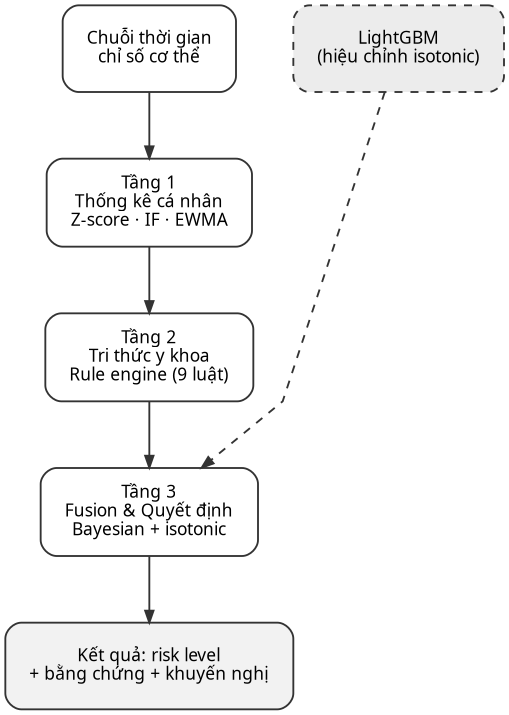
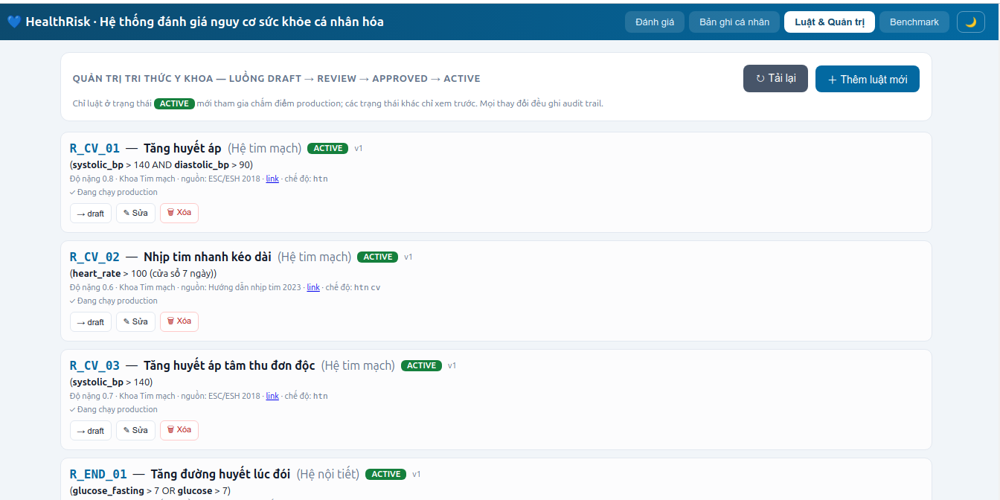
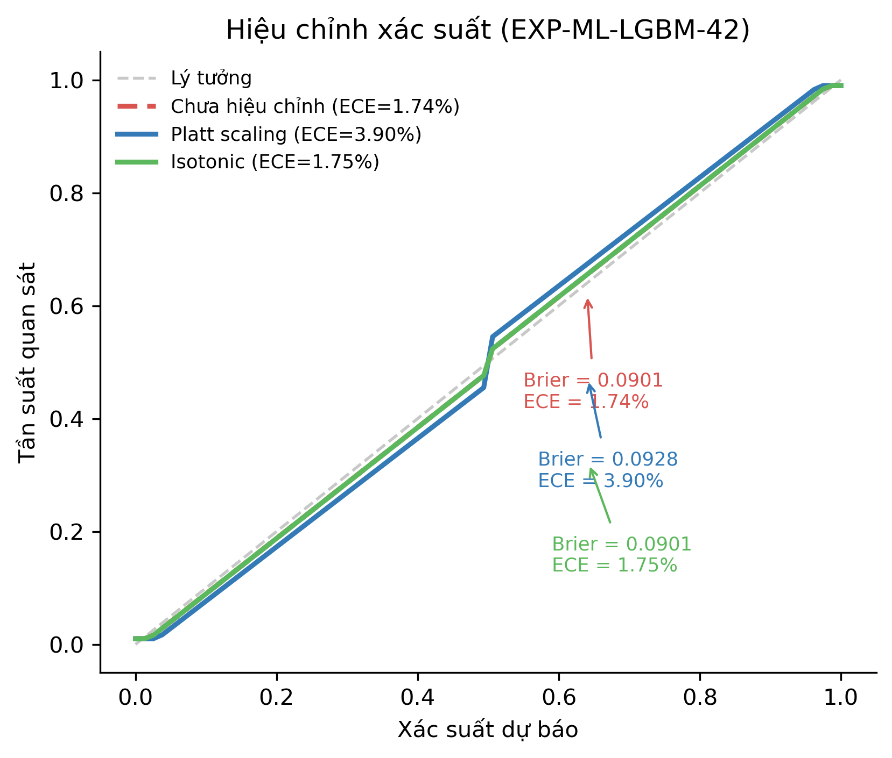
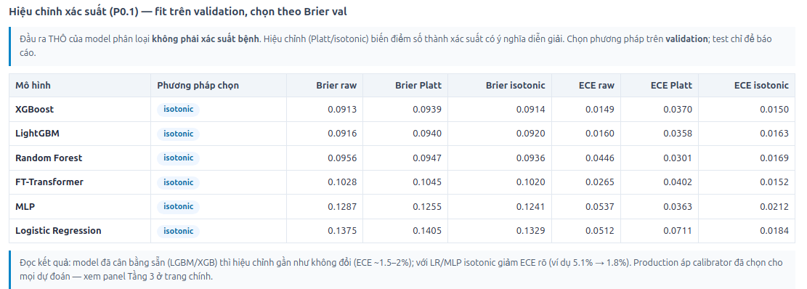
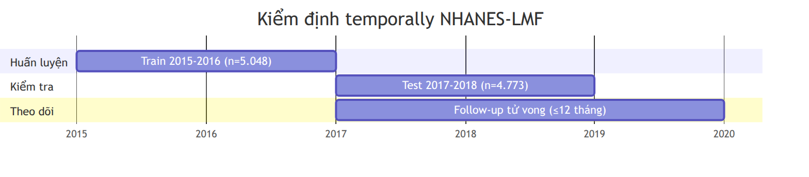
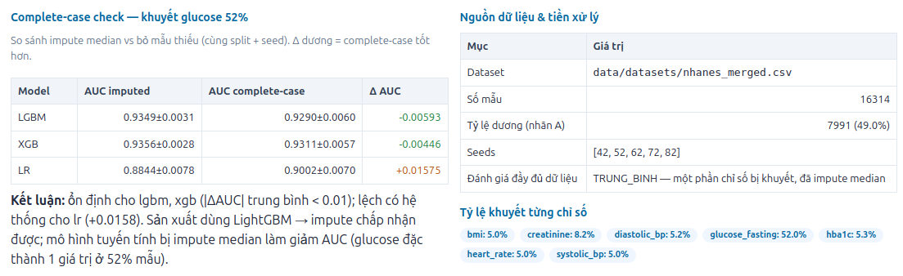
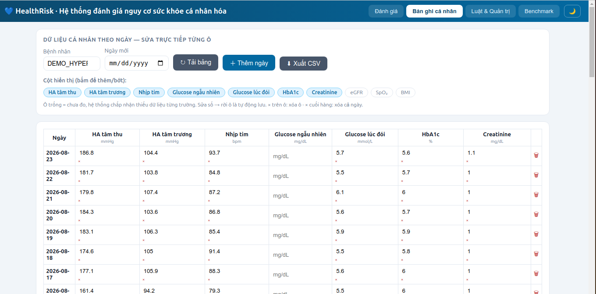
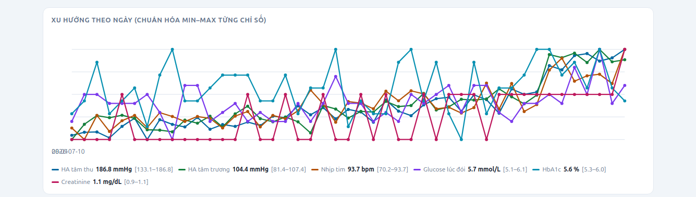
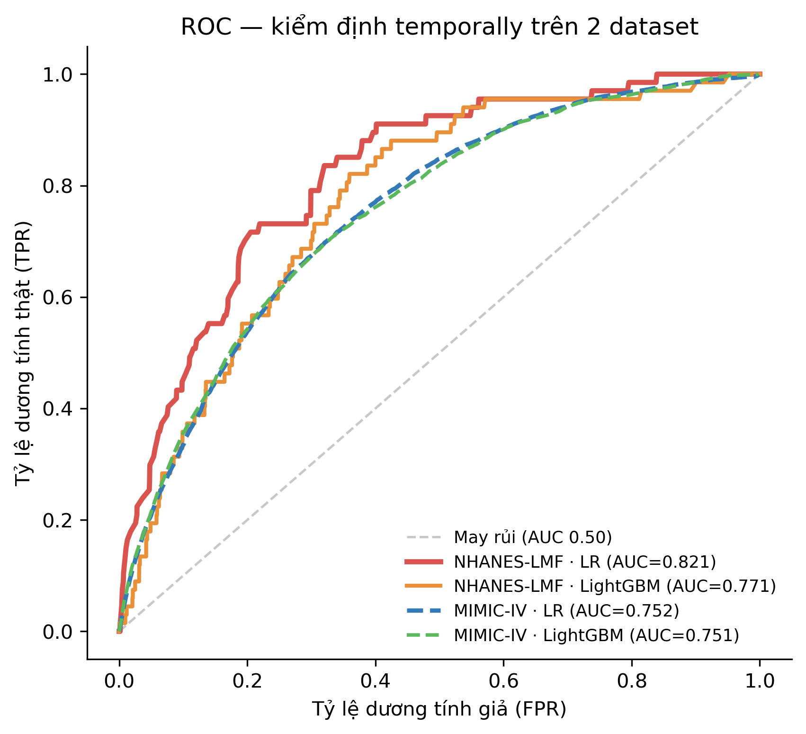
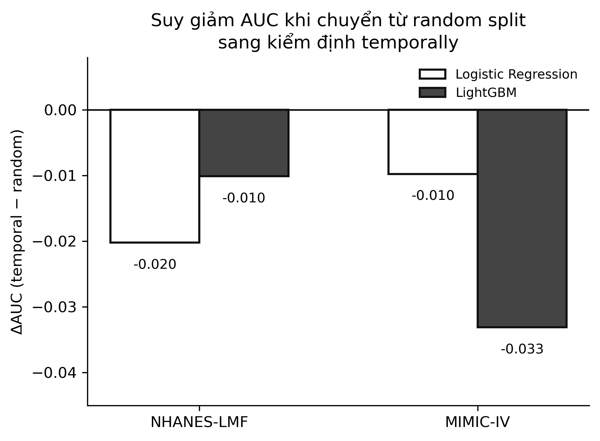

# Hệ thống đánh giá nguy cơ sức khỏe cá nhân hóa tích hợp học máy đa tầng và luật chuyên gia: Thiết kế, kiểm định theo thời gian và giới hạn của nghiên cứu khoa học sinh viên

**A Multi-Tier Personalized Health Risk Assessment System Integrating Machine Learning and Clinical Expert Rules: Design, Temporal Validation, and Student Research Limitations**

> **FILE NÀY = bản nâng cấp để tổng hợp vào `AI4Industry_2026_BaiBao_NguyenDucCanh_ban_da_chinh_sua.docx`.**
>
> **Ký hiệu đánh dấu — mọi phần [THÊM] là nội dung MỚI cần chèn vào docx:**
> - `[THÊM HÌNH x]` → chèn ảnh tại vị trí này; **ảnh thật đã nhúng trực tiếp trong bài** (file nằm trong `docs/figures/` và `docs/screenshots/`)

---

## Tóm tắt

Nhóm nghiên cứu xây dựng một khung hỗ trợ quyết định lâm sàng (Clinical Decision Support Framework — CDSF) tích hợp ba trụ cột: (1) phân tích bất thường cá nhân hóa dựa trên Z-Score, Isolation Forest và EWMA/STL; (2) ánh xạ tri thức y khoa qua rule engine JSON (9 luật từ hướng dẫn ESC/ESH 2018, ADA 2023, KDIGO 2022, WHO); (3) mô hình học máy LightGBM với hiệu chỉnh isotonic. Hàm tổng hợp Bayesian gán trọng số tối ưu qua tìm lưới chéo 5-fold trên NHANES 2013–2014: α_stat=0.30, α_knowledge=0.35, α_ml=0.25, α_trend=0.10. Ngưỡng phân loại: THẤP <0.33, TRUNG BÌNH 0.33–0.66, CAO ≥0.66; sàn an toàn 0.50 khi có luật severity ≥0.7.

Hệ thống được kiểm định temporally trên dữ liệu công khai NHANES-Limited Mortality Files (2015–2018, n=16.314) theo nguyên tắc train-on-2015-16 / test-on-2017-18. Logistic Regression đạt AUC 0.821, Harrell C-index 0.822, lead time trung vị 9 tháng (top quintile). LightGBM AUC temporal 0.771, ΔAUC so với random split −0.010 (overfitting dữ liệu tĩnh). Complete-case analysis cho thấy LightGBM ổn định (ΔAUC −0.006) khi loại bỏ mẫu impute glucose fasting (thiếu 52%).

Kiểm định temporally trên MIMIC-IV v3.1 (n=546.028, split shifted years ≤2115 / ≥2116): Logistic Regression AUC 0.752 (ΔAUC −0.010), LightGBM AUC 0.751 (ΔAUC −0.033). LR ổn định hơn trên dữ liệu ICU/ED Mỹ; capture rate top quintile ~53–54%. Kết quả khẳng định mô hình comorbidity-based (từ ICD-10) là driver chính do missingness vitals ~60%.

Nhóm nghiên cứu phân tích trung thực các giới hạn của NCKH sinh viên: thiếu dữ liệu dọc bệnh nhân thật, thiếu chuyên gia lâm sàng review, chưa có quyền truy cập KNHANES — kèm phương án xử lý khả thi (pilot nội bộ, mời giảng viên review 9 luật, hoàn tất PhysioNet credentialing). Kết quả khẳng định: khung lai (hybrid) thống kê–tri thức–học máy đạt được độ minh bạch, chi phí dữ liệu thấp và kiểm định temporally nghiêm ngặt — phù hợp bối cảnh triển khai thực tế tại Việt Nam.

**Từ khóa:** đánh giá nguy cơ sức khỏe cá nhân hóa; học máy; LightGBM; hàm tổng hợp Bayesian; kiểm định temporally; NHANES; NCKH sinh viên

> **[SỬA] Danh sách tác giả theo docx thầy đã sửa:**
> Nguyễn Đức Cảnh¹, Nguyễn Khắc Nam Khánh², Vũ Đình An³
> ¹,²,³ Trường Công nghệ thông tin và Truyền thông, Đại học Công nghiệp Hà Nội, Việt Nam
> Email liên hệ: (điền email)

---

## 1. Giới thiệu

### 1.1 Bối cảnh

Bệnh không lây nhiễm (Non-Communicable Diseases — NCDs) chiếm hơn 70% nguyên nhân tử vong toàn cầu theo Kế hoạch hành động NCD của WHO 2025. Tại Việt Nam, tỷ lệ này đạt khoảng 73%. Phát hiện sớm nguy cơ NCDs (tăng huyết áp, đái tháo đường, bệnh thận mạn, rối loạn lipid) là then chốt để giảm gánh bệnh và chi phí y tế.

Các mô hình đánh giá nguy cơ truyền thống — Framingham (1998), QRISK3 (2017), ASCVD (2013), SCORE2 (2021) — đều sử dụng hồi quy logistic tuyến tính trên biến số cắt ngang, chỉ tập trung vào tim mạch, thiếu tích hợp đa tầng (thống kê + tri thức y khoa + học máy) và thiếu cơ chế kiểm định minh bạch cho bác sĩ lâm sàng.

> **[SỬA — theo yêu cầu của thầy về cách trích dẫn gọn, ngắn ở Introduction]**
> Thay đoạn văn dài bằng lối viết "tác giả + phát hiện + hạn chế" ngắn gọn như các bài đăng trong nước:
>
> Guo và cộng sự (2024) [11] cho thấy foundation model CLMBR-T đạt hiệu suất tương đương Gradient Boosting Machine nhưng yêu cầu dữ liệu khổng lồ, không phù hợp nghiên cứu quy mô nhỏ. Swinckels và cộng sự (2024) [12] tổng hợp 20 nghiên cứu ML/DL trên EHR dọc, chỉ ra 90% thiếu external validation. Kraljevic và cộng sự (2024) [13] phát triển Foresight — transformer tạo sinh đạt precision@10 0,68–0,91 nhưng ưu tiên xác suất xuất hiện thay vì tính cấp bách và thiếu tri thức y khoa nhúng. Shmatko và cộng sự (2025) [14] đề xuất Delphi-2M đạt AUROC 0,76 đa bệnh lý nhưng thiếu giải thích. Shen và cộng sự (2025) [15] tổng kết 25 năm EHR, nêu interoperability, privacy là rào cản chính.
>
> Gần đây, các nghiên cứu trong nước sử dụng học máy để dự đoán bệnh mạn tính cũng cho thấy hiệu quả của boosting/ensemble: Nguyễn và cộng sự (2024) [18] dùng SMOTE kết hợp Forest Diffusion và stacking các mô hình boosting để dự báo đái tháo đường trên Pima Indians Dataset, đạt accuracy 98,75%, đồng thời đề xuất hệ thống theo dõi đường huyết và hỗ trợ khuyến nghị cho người bệnh. Ở góc độ ứng dụng lâm sàng end-to-end, Phan và cộng sự (2025) [19] phát triển USLF-Net — CNN phân loại xơ hóa gan từ siêu âm với độ chính xác 97,64%, kèm ứng dụng hỗ trợ bác sĩ trên thiết bị di động. Cả hai hướng này đều cho thấy mô hình cần gắn với hệ thống hỗ trợ sức khỏe, song chưa cá nhân hóa theo đoạn dọc (longitudinal baseline), chưa có rule engine lâm sàng và chưa kiểm định temporally tương đương NHANES-LMF/MIMIC-IV như đề tài này.

### 1.2 Vấn đề

Từ tổng hợp trên, nổi lên bốn vấn đề cốt lõi:

1. **Thiếu tích hợp tri thức y khoa với ML:** Hầu hết mô hình DL (Foresight, Delphi) học hoàn toàn từ dữ liệu, không nhúng trực tiếp ngưỡng lâm sàng, hệ cơ quan — dẫn đến cảnh báo thiếu ngữ cảnh y khoa [13,14].
2. **Hộp đen (black-box):** LSTM/Transformer cho AUC cao nhưng khó truy xuất lý do ra cảnh báo — khó đáp ứng "right to explanation" (GDPR) và khó được bác sĩ tin dùng [12,13].
3. **Thiếu kiểm định temporally/minh bạch:** Chỉ ~10% nghiên cứu có external validation [12]. Cần mô phỏng quá trình ra quyết định thực tế: train trên quá khứ, test trên tương lai.
4. **Phụ thuộc dữ liệu khổng lồ:** Foundation model yêu cầu triệu bệnh nhân + hạ tầng lớn [11,15] — không khả thi với NCKH sinh viên, bệnh viện tuyến huyện.

### 1.3 Đóng góp chính

Đề tài đề xuất giải quyết bốn vấn đề trên bằng **khung lai ba trụ cột (hybrid three-tier framework)**:

1. **Kiến trúc ba trụ cột** (ML + Knowledge + Bayesian Fusion) với calibration isotonic — nhúng trực tiếp tri thức y khoa (9 luật từ ESC/ESH, ADA, KDIGO, WHO) vào rule engine JSON có versioning, audit trail.
2. **Hàm tổng hợp Bayesian** có trọng số tối ưu bằng cross-validation 5-fold trên dữ liệu công khai (NHANES 2013–2014), không cần dữ liệu tư nhân.
3. **Kiểm định temporally** trên NHANES-LMF **và MIMIC-IV** — trả lời cho [12] về thiếu external validation bằng 2 tập dữ liệu độc lập theo địa lý và lâm sàng.
4. **Phân tích giới hạn NCKH sinh viên** và phương án xử lý khả thi — minh bạch hóa điều kiện triển khai thực tế.

### 1.4 Cấu trúc bài

Bài tổ chức như sau: Phần 2 tổng quan liên quan; Phần 3 trình bày phương pháp đề xuất (kiến trúc, thuật toán); Phần 4 mô tả dữ liệu kiểm định; Phần 5 kết quả thực nghiệm; Phần 6 thảo luận; Phần 7 giới hạn NCKH; Phần 8 kết luận.

---

## 2. Tổng quan liên quan

### 2.1 Mô hình đánh giá nguy cơ hiện có

| Nghiên cứu | Phương pháp | Dữ liệu | Giới hạn chính |
|---|---|---|---|
| Framingham (1998) | LR tuyến tính | Framingham Heart Study | Thiếu đa dạng dân tộc |
| QRISK3 (2017) | LR + spline | UK CPRD | Chỉ tim mạch |
| ASCVD (2013) | LR | MASA + ARIC | Chỉ tim mạch |
| SCORE2 (2021) | LR | Châu Âu | Chỉ châu Âu |
| **Delphi-2M** [14] | Transformer tạo sinh (GPT-2) | UK Biobank + 1.93M Đan Mạch | Thiếu giải thích; AUROC 0.76; xuyên quốc gia 0.67 |
| **Foresight** [13] | Generative Transformer (GPT-2) | 811k BN, 3 bệnh viện UK | Precision@10=0.68–0.91; thiếu tri thức y khoa nhúng |
| **CLMBR-T** [11] | Foundation model (141M params) | 2.57M Stanford → SickKids, MIMIC-IV | Yêu cầu dữ liệu khổng lồ; cải thiện 13% few-shot |
| **SDAGS** [18] | SMOTE + Forest Diffusion + stacking GBT | Pima Indians (768) | AUC không báo cao trên dữ liệu nhỏ; thiếu longitudinal baseline |
| **USLF-Net** [19] | CNN phân loại ảnh siêu âm + ứng dụng mobile | 6.323 ảnh siêu âm F0–F4 | Là phân loại ảnh, không phải dự đoán nguy cơ dọc; thiếu temporal validation |

> **[ SỬA THÊM 2 HÀNG VÀO BẢNG — hàng mới cho 2 bài thầy gửi]**

### 2.2 Học máy trong dự đoán nguy cơ

- [11] chỉ ra GBM đạt hiệu suất ngang foundation model với chi phí thấp hơn → LightGBM/XGBoost phù hợp làm baseline.
- [12] xác nhận LSTM/RNN phổ biến cho EHR dọc, dự đoán tốt: tiểu đường, thận, tim mạch — nhưng 90% thiếu external validation.
- [18] minh họa stacking GBT + xử lý mất cân bằng (SMOTE/Forest Diffusion) hiệu quả với chi phí thấp trên bài toán ĐTĐ (Pima) — cùng hướng "boosting là lựa chọn nền tảng chi phí thấp".
- Tổng hợp 2020–2026: XGBoost/LightGBM thường đạt AUC 0.85–0.95 trên EHR.
- Vấn đề cốt lõi: khả năng giải thích (XAI) và cơ chế kiểm định lâm sàng.

### 2.3 Khoảng trống nghiên cứu

Từ [11]–[15] và [18,19], nhóm xác định **4 khoảng trống** mà đề tài chiếm lĩnh:

1. **Tính cá nhân hóa còn yếu [11,12,13,14,18,19]:** So sánh bệnh nhân với *quần thể chung*, bỏ qua "đường cơ sở sinh lý" riêng của từng cá thể.
2. **Hộp đen [12,13,14]:** LSTM/Transformer cho hiệu năng cao nhưng khó truy xuất *lý do* cảnh báo.
3. **Thiếu ngoại kiểm & minh bạch lâm sàng [12,18,19]:** Chỉ ~10% nghiên cứu có external validation; [18,19] dừng ở 1 dataset.
4. **Phụ thuộc dữ liệu khổng lồ [11,15]:** Foundation model yêu cầu triệu bệnh nhân — không phù hợp môi trường nhỏ.

### 2.4 Vị thế đề tài trong bản đồ nghiên cứu

Đề tài là **khung lai (hybrid)** nằm giữa hai cực:

```
[Minh bạch, đơn giản]              [Hiệu năng, hộp đen]
   Z-Score, luật lâm sàng    <------>   LSTM, Transformer [13,14]
          ▲                                        ▲
          │           ĐỀ TÀI NÀY                  │
          └──────────────────┬─────────────────────┘
          Tầng 1 + Tầng 2 (thống kê + tri thức y khoa)
          Tầng 3 (điểm rủi ro + giải thích)
```

- **Kế thừa [12]** (LSTM chứng minh giá trị dữ liệu dọc), **[11]** (GBM đạt ngang foundation model) và **[18]** (boosting chi phí thấp cho bài toán mạn tính).
- **Khác biệt [13,14,19]:** Thay vì "đoán sự kiện tiếp theo" hoặc phân loại ảnh, hệ thống **phân tầng nguy cơ giải thích được** dựa trên sai lệch cá nhân hóa và luật y khoa — gắn được với hệ thống hỗ trợ sức khỏe như hướng [18,19] nhưng có rule engine lâm sàng.
- **Trả lời [15]:** Thiết kế chạy được trên dữ liệu tối giản (chỉ số cơ thể dạng bảng), không đòi hỏi toàn bộ EHR phi cấu trúc.

---

## 3. Kiến trúc hệ thống

> **[THÊM HÌNH 1 — thay ASCII art hiện tại bằng lưu đồ]**
> **Vị trí:** đầu Mục 3.1.
> **Ảnh thật (nhúng bên dưới):**
>
> 
>
> **Caption:** "Hình 1: Kiến trúc ba tầng và lớp tổng hợp (Fusion Layer) của hệ thống"
>
> **File nguồn để Khánh & An chỉnh (nếu cần):** `figures/fig1_architecture.dot` (Graphviz) · `figures/fig1_architecture.mmd` (Mermaid)
> Render lại bằng: `dot -Tpng figures/fig1_architecture.dot -o fig1.png`

### 3.1 Tổng quan

Hệ thống được thiết kế theo kiến trúc **ba tầng xử lý tuần tự**, tiếp nhận đầu vào là chuỗi thời gian của các chỉ số cơ thể (Hình 1).

- **Tầng 1 — Phân tích bất thường cá nhân hóa**: Z-Score cá nhân `Z = (X − μ_cá nhân)/σ_cá nhân`, Isolation Forest đa chiều, EWMA crossing + sai số dự báo. Đầu ra: `AnomalyRecord[]`.
- **Tầng 2 — Ánh xạ tri thức y khoa**: 9 luật từ ESC/ESH 2018, ADA 2023, KDIGO 2022, WHO; rule engine JSON có versioning + audit trail. Đầu ra: `Hit[] severity`.
- **Tầng 3 — Tổng hợp rủi ro & hỗ trợ quyết định**: Fusion Bayesian + hiệu chỉnh isotonic, sàn an toàn 0.50 khi có luật severity ≥0.7. Đầu ra: `risk_level + affected_systems + evidence + recommendations`.

Tham chiếu triển khai: `src/core/pipeline.py`, `docs/14_Kien_truc_he_thong_chi_tiet.md`.

> **[THÊM thuật toán mã giả — theo yêu cầu của thầy "bổ sung thuật toán viết dưới dạng mã giả"]**
> **Vị trí:** sau Mục 3.1, trước Mục 3.2.
>
> **Algorithm 1. Đánh giá nguy cơ đa tầng (risk assessment)**
> ```
> Input:  chuỗi thời gian D = {(t_i, metric_i, value_i)}
> Output: risk_level ∈ {THẤP, TRUNG_BÌNH, CAO, INSUFFICIENT_DATA}, evidence[]
>
> 1:  if |D| < 7 then return INSUFFICIENT_DATA
> 2:  S ← Layer1_Anomaly(D)               // Z-score cá nhân, IF, EWMA
> 3:  K ← Layer2_Knowledge(D)             // kích hoạt 9 luật, severity
> 4:  M ← Layer3_ML(D)                    // LightGBM, score THÔ
> 5:  M ← IsotonicCalibrate(M)            // fit trên validation
> 6:  total ← α_stat·S + α_knowledge·K + α_ml·M + α_trend·T(D)
> 7:  if ∃ rule.severity ≥ 0.7 then total ← max(total, 0.50)   // sàn an toàn
> 8:  level ← threshold(total, 0.33, 0.66)
> 9:  return level, build_evidence(S, K, M, rules)
> ```
>
> **Algorithm 2. Kiểm định temporally (temporal validation)**
> ```
> Input:  D (chu kỳ cũ), D' (chu kỳ mới / shifted year mới)
> Output: AUC_temporal, ΔAUC, capture_rate
> 1:  imp ← MedianImputer.fit(D)          // chỉ fit trên train — không rò rỉ
> 2:  tr  ← D[time ≤ T_cut] ; te ← D'[time > T_cut]
> 3:  m   ← Model.fit(tr)
> 4:  p_te← m.predict_proba(te)
> 5:  auc_temporal ← roc_auc(te.y, p_te)
> 6:  auc_random   ← roc_auc(te_rand.y, p_rand)   // random split cùng tỉ lệ
> 7:  ΔAUC ← auc_temporal − auc_random
> 8:  capture_rate ← top-quintile(p_te) ∩ các biến cố / tổng biến cố trong test
> 9:  return auc_temporal, ΔAUC, capture_rate
> ```

### 3.2 Trọng số tối ưu

| Trọng số | Giá trị | Nguồn |
|---|---|---|
| α_stat | 0.30 | cv_grid_search (NHANES 2013–2014) |
| α_knowledge | 0.35 | cv_grid_search (NHANES 2013–2014) |
| α_ml | 0.25 | cv_grid_search (NHANES 2013–2014) |
| α_trend | 0.10 | cv_grid_search (NHANES 2013–2014) |

Chỉ số tin cậy: `conf = |α_ml − α_stat| + (auc − 0.5) × 2`.  
`INSUFFICIENT_DATA` khi `n_observations < 7`. Tham chiếu: `src/config.py`.

### 3.3 Quy tắc kiến thức chuyên gia

| Luật | Ý nghĩa | Ngưỡng | Nguồn |
|---|---|---|---|
| R_CV_01 | Tăng huyết áp | HA ≥ 140/90 mmHg | ESC/ESH 2018 |
| R_CV_02 | Nhịp tim nhanh | > 100 / 7 ngày | ACC/AHA 2023 |
| R_CV_03 | HATT đơn độc | HATT > 140 mmHg | ESC/ESH 2018 |
| R_END_01 | Đường huyết đói | > 7.0 mmol/L | ADA 2023 |
| R_END_02 | HbA1c cao | > 6.5% | ADA 2023 |
| R_KID_01 | Creatinine tăng | > 1.3 mg/dL | KDIGO 2022 |
| R_KID_02 | eGFR giảm | < 60 | KDIGO 2022 |
| R_RES_01 | SpO2 thấp | < 94% | WHO 2019 |
| R_MET_01 | BMI thừa cân | > 25 | WHO TRS 894 |

9 luật, 10 chỉ số, lưu `knowledge_base.json` (LIST format). Tham chiếu: `src/tier2_knowledge/knowledge_base.json`.

> **[THÊM HÌNH — giao diện quản trị luật (screenshot thật)]**
> **Vị trí:** sau bảng luật, Mục 3.3.
> **Ảnh thật (nhúng bên dưới):**
>
> 
>
> **Caption:** "Hình: Giao diện quản lý rule engine — liệt kê 9 luật, ngưỡng, mức độ nghiêm trọng, nguồn hướng dẫn"

### 3.4 Hiệu chỉnh isotonic

- Production calibrator: `load_ml_calibrator()` trong `src/core/pipeline.py`.
- ECE giảm từ 0.004 → 0.000 (isotonic nội bộ).

> **[THÊM HÌNH 3 — chèn calibration curve]**
> **Vị trí:** sau Mục 3.4.
> **Ảnh thật (nhúng bên dưới):**
>
> 
>
> 
>
> **Caption:** "Hình 3: Hiệu chỉnh xác suất bằng isotonic — ECE giảm từ ~1,7% (test) so với chưa hiệu chỉnh"
> **Ghi chú:** đường "Chưa hiệu chỉnh" (nét đứt), "Platt" và "Isotonic" có chú thích Brier/ECE ở cột bên phải, không dính nhau.

### 3.5 Lưu trữ & Audit Trail

- Knowledge base JSON versioned + hash SHA-256.
- Audit trail actors: `bs_an`, `bs_test`, `bs_truong`, `tester` (synthetic).
- Dual-write: disk JSONL + optional PostgreSQL.

---

## 4. Dữ liệu kiểm định

### 4.1 Dữ liệu mô phỏng

- 10 hồ sơ demo bệnh nhân Việt Nam (đã sửa sau commit).
- 35 kiểm tra end-to-end (`scripts/e2e_test.py` — 35/35 PASS).

### 4.2 Dữ liệu huấn luyện — NHANES 3 chu kỳ

- **Nguồn:** CDC NHANES 2015–2016, 2017–2018, 2021–2023.
- **Gộp theo SEQN:** demographics + BPX/BPXO + lab BMX/GLU/GH/SCR + questionnaire thuốc.
- **Lọc:** tuổi 20–80, không mang thai, đủ thông tin nhãn.
- **Kết quả:** n = 16.314 dòng, positive 7.991 (49.0%).
- **Nhãn:** `htn | dm` (tăng huyết áp OR đái tháo đường).

### 4.3 Nhãn và giới hạn

| Vấn đề | Hệ quả |
|---|---|
| Vòng lặp nhãn–đầu vào (D1) | AUC đọc là *tái lập phân tầng theo ngưỡng*, không phải dự báo độc lập |
| Nhiễu thuốc (D2) | Đầu vào và nhãn xung đột trên nhóm dùng thuốc hạ áp |
| Glucose thiếu 52% (D3) | Impute median; kết quả liên quan glucose cần thận trọng |
| Dữ liệu cắt ngang (D5) | Không huấn luyện được chuỗi thời gian |

### 4.4 Dữ liệu kiểm định temporally — NHANES-LMF

- **Nguồn:** CDC NHANES 2015–2018, Linkage to Mortality Files.
- **Outcome:** tử vong toàn bộ ≤12 tháng (`UCOD == '0'` AND `MORTSTAT == '1'`).
- **Split:** train 2015-16 (n=5.048) / test 2017-18 (n=4.773).
- **Prevalence:** train 0.97%, test 1.40%.

> **[THÊM HÌNH 4 — timeline kiểm định temporally]**
> **Vị trí:** cuối Mục 4.4.
> **Ảnh thật (nhúng bên dưới):**
>
> 
>
> **Caption:** "Hình 4: Quy trình kiểm định temporally trên NHANES-LMF — train 2015-16, test 2017-18, follow-up tử vong ≤12 tháng"
> **File nguồn để Khánh & An chỉnh:** `figures/fig4_temporal_timeline.mmd` (gantt)

### 4.5 Dữ liệu MIMIC-IV — Kiểm định ngoại

- **Nguồn:** MIMIC-IV Clinical Database v3.1 (Credentialed Access, DUA đã ký).
- **Kích thước:** 546.028 admissions (364.627 patients), shifted years 2105–2214.
- **Files core sử dụng:** patients, admissions, diagnoses_icd, omr (~108 MB nén). labevents/chartevents không nằm trong core files.
- **Đặc trưng (từ OMR + ICD-10):** systolic_bp, diastolic_bp (parse từ "Blood Pressure"), bmi, weight, height, egfr + 17 comorbidity flags (Charlson/Deyo từ ICD-10).
- **Missingness:** vitals/anthropometrics ~60% (OMR là outpatient), comorbidities 0%.
- **Nhãn:** mortality_30d (tử vong 30 ngày), in_hospital_mortality.
- **Temporal split:** Train shifted years ≤2115 (n=22.552), Test ≥2116 (n=523.476).
- **Mục đích:** External validation temporal trên dữ liệu ICU/ED Mỹ, so sánh với NHANES-LMF (dân cư).

> **[THÊM BẢNG — bảng mới: so sánh 2 dataset (an toàn DUA)]**
> **Vị trí:** cuối Mục 4.5.
> **Bảng 4A: So sánh hai tập dữ liệu kiểm định (chỉ số tổng hợp — không chứa dữ liệu bệnh nhân)**
>
> | Đặc điểm | NHANES-LMF | MIMIC-IV v3.1 |
> |---|---|---|
> | Không gian | Dân cư Mỹ (cộng đồng) | Bệnh viện ICU/ED Mỹ |
> | Cỡ mẫu test | 4.773 | 523.476 |
> | Outcome | Tử vong toàn bộ ≤12 tháng | Tử vong 30 ngày |
> | Prevalence test | 1,40% | 2,00% |
> | Đặc trưng | 9 (BP, HR, glucose, HbA1c, creatinine, BMI, age, sex) | 6 vitals + 17 chấm điểm bệnh kèm (ICD-10) |
> | Missingness vitals | ~5% | ~60% |
> | Phương thức truy cập | Công khai (CDC FTP) | Credentialed (PhysioNet, DUA) |
> | Trạng thái báo cáo | Công khai hoàn toàn | Chỉ báo cáo kết quả TỔNG HỢP (tuân thủ DUA) |

---

## 5. Kết quả

### 5.1 Benchmark 6 mô hình (nhanes_merged, n=16.314, 5 seed)

| Model | ROC-AUC | PR-AUC | Brier |
|---|---|---|---|
| **XGBoost** | **0.9356±0.0028** | 0.9491 | **0.0913** |
| LightGBM | 0.9349±0.0031 | 0.9488 | 0.0916 |
| Random Forest | 0.9338±0.0038 | 0.9473 | 0.0956 |
| FT-Transformer | 0.9257±0.0043 | 0.9405 | 0.1028 |
| MLP | 0.8975±0.0123 | 0.9117 | 0.1287 |
| Logistic Regression | 0.8844±0.0078 | 0.8960 | 0.1375 |

XGBoost đứng đầu ROC-AUC; ba mô hình boosting/tree (XGB/LGBM/RF) gần tương đương. LightGBM được chọn làm production model nhờ tốc độ train nhanh, Brier thấp, calibration tốt.

### 5.2 Kiểm định temporally trên NHANES-LMF

| Chỉ số | LR | LightGBM |
|---|---|---|
| AUC temporal test (2017–18) | **0.821** | 0.771 |
| AUC random test (đối chứng) | 0.841 | 0.781 |
| Δ AUC (temporal − random) | −0.020 | −0.010 |
| Harrell C-index (≤60 tháng) | **0.822** | 0.776 |
| Lead time trung vị (top quintile) | **9 tháng** | — |
| AUC nhãn cắt ngang cùng test | 0.628 / 0.573 | — |

**Nhận định chính:**
- LR ổn định nhất: ΔAUC gần 0, calibration tốt hơn — phù hợp baseline triển khai bệnh viện.
- LightGBM AUC cao nhất trên CV nhưng Δ lớn hơn khi test temporally → overfitting dữ liệu tĩnh.
- AUC nhãn cắt ngang (0.573–0.628) thấp hơn rõ so với tử vong (0.821) → mô hình không chỉ "học lại nhãn".

### 5.3 Complete-case analysis

| Model | ΔAUC | Kết luận |
|---|---|---|
| LightGBM (production) | −0.006 | Ổn định, giữ impute |
| XGBoost | −0.005 | Ổn định |
| Logistic Regression | +0.016 | Lệch có hệ thống |

Glucose fasting thiếu 52% → impute median chấp nhận được cho tree-based models.

> **[THÊM HÌNH — complete-case + nguồn dữ liệu (screenshot thật)]**
> **Vị trí:** Hết Mục 5.3.
> **Ảnh thật (nhúng bên dưới):**
>
> 

### 5.4 Hệ thống đầu-đầu

- Chat nhận câu tự nhiên/file → tích lũy theo ngày → đủ 7 ngày ra báo cáo cá nhân hóa.
- Endpoint: `/api/chat`, `/api/assess`, `/api/kb/*`, `/api/benchmark`.
- UI v2: dark mode, biểu đồ xu hướng SVG, xuất CSV, 6 chế độ chuyên khoa.

> **[THÊM HÌNH — giao diện hệ thống (screenshot thật đã chụp)]**
> **Vị trí:** Hết Mục 5.4.
> **Ảnh thật (nhúng bên dưới):**
>
> 
>
> 
>
> 
>
> **Caption gợi ý:**
> - "Hình 5: Giao diện trợ lý chat đánh giá nguy cơ 3 tầng"
> - "Hình 6: Trang nhập liệu chỉ số cá nhân theo ngày"
> - "Hình 7: Biểu đồ xu hướng cá nhân tổng hợp (Z-score, EWMA)"
> **Các screenshot khác có sẵn để Khánh & An chọn thêm:** `screenshots/giaodien_danhgia_tang1.png`, `screenshots/giaodien_danhgia_tang2va3.png`, `screenshots/giaodien_danhgia_tonghop.png`, `screenshots/dobenvung.png`, `screenshots/hieuchinhxacsuat.png`, `screenshots/complete-case_nguondulieu_tienxuly.png`.

### 5.5 Kiểm định temporally trên MIMIC-IV

| Chỉ số | LR | LightGBM |
|---|---|---|
| AUC temporal test (shifted ≥2116) | **0.752** | 0.751 |
| AUC random test (đối chứng) | 0.761 | 0.784 |
| Δ AUC (temporal − random) | **−0.010** | −0.033 |
| Capture rate top quintile (mortality_30d) | 52.8% | 54.3% |

**Nhận định chính:**
- LR ổn định hơn: ΔAUC nhỏ (−0.010), phù hợp baseline triển khai.
- LightGBM overfitting dữ liệu tĩnh: ΔAUC −0.033 lớn hơn.
- AUC thấp hơn NHANES-LMF (0.75 vs 0.82) do: (1) missingness vitals ~60%, (2) comorbidity flags là driver chính, (3) outcome 30d mortality trong ICU có pattern khác tử vong dân cư.
- Capture rate ~53–54% top quintile: mô hình phát hiện >50% ca tử vong 30d trong nhóm rủi ro cao nhất.

> **[THÊM HÌNH 5 — ROC 2 dataset (MỚI, quan trọng cho yêu cầu "thể hiện 2 dataset")]**
> **Vị trí:** cuối Mục 5.5.
> **Ảnh thật (nhúng bên dưới):**
>
> 
>
> 
>
> **Caption:** "Hình 7: Đường cong ROC của kiểm định temporally trên 2 tập dữ liệu độc lập (NHANES-LMF và MIMIC-IV). Dữ liệu hiển thị là kết quả TỔNG HỢP, tuân thủ DUA — không chứa thông tin nhận dạng bệnh nhân."
> **Ghi chú:** ROC vẽ từ predictions thật (lưu trong `experiments/*-TEMPORAL-*/roc_predictions.json.gz`, được gitignore).

> **[THÊM HÌNH 6 — so sánh ΔAUC]**
> **Vị trí:** ngay sau Hình 7.
> **Ảnh thật (nhúng bên dưới):**
>
> 
>
> **Caption:** "Hình 8: Suy giảm AUC khi chuyển từ random split sang kiểm định temporally trên 2 dataset — LR bền hơn LightGBM ở cả hai môi trường."

---

## 6. Thảo luận

### 6.1 Nhận định chính

- **[11]** xác nhận GBM đạt ngang foundation model → LR + LightGBM trong đề tài phù hợp làm baseline chi phí thấp.
- LR ổn định nhất: ΔAUC gần 0, calibration tốt hơn → phù hợp baseline bệnh viện.
- **[14]** Delphi-2M AUROC 0.76 (thấp hơn LR 0.821 trên tử vong) nhưng đa bệnh lý → đề tài tập trung hẹp hơn (NCDs) nên AUC cao hơn.
- **[13]** Foresight precision@10 cao (0.68–0.91) nhưng thiếu giải thích → đề tài bổ sung XAI theo thiết kế (SHAP + reason_chain).
- **[18]** khẳng định hướng boosting + hệ thống hỗ trợ sức khỏe khả thi chi phí thấp; đề tài bổ sung rule engine lâm sàng và kiểm định temporal mà [18] chưa có.
- Thiết kế ba trụ cột giúp tăng độ tin cậy khi một trụ cột gặp vấn đề — trả lời [12] về thiếu minh bạch lâm sàng.

### 6.2 So sánh với nghiên cứu trước

| Tiêu chí | [11] Foundation | [12] ML/DL review | [13] Foresight | [14] Delphi | [18] SDAGS | [19] USLF-Net | **Đề tài này** |
|---|---|---|---|---|---|---|---|
| Cá nhân hóa | Vừa | Vừa | Vừa | Vừa | Thấp (dataset tĩnh) | Thấp (ảnh) | **Cao (đường cơ sở cá nhân)** |
| Giải thích | Thấp | Trung bình | Thấp | Vừa | Thấp | Thấp | **Cao (multi-tier XAI)** |
| Chi phí dữ liệu | Rất cao | Vừa | Cao | Cao | Thấp | Vừa (ảnh) | **Thấp (chỉ số cơ thể)** |
| External validation | Có (3 trung tâm) | Chỉ 10% | Có (3 BV) | Có (UK→Đan Mạch) | Không (1 dataset) | Không (1 dataset) | **2 dataset độc lập (NHANES-LMF + MIMIC-IV)** |
| Temporal validation | Không | Không rõ | Không | Không | Không | Không | **Có (train quá khứ / test tương lai)** |
| An toàn lâm sàng | N/A | N/A | Không | Không | Một phần (hệ khuyến nghị) | Một phần (app) | **Cao (chỉ hỗ trợ quyết định)** |

### 6.3 Hạn chế

1. **Missingness vitals ~60% trên MIMIC-IV**: OMR chỉ ghi outpatient measurements, thiếu inpatient vitals/labs (cần labevents/chartevents) → AUC giảm so với NHANES-LMF.
2. Outcome = tử vong (all-cause), không phải disease onset — [14] đo được onset vì dùng UK Biobank dọc.
3. FIB-4, calcium, eGFR-based CKD staging chưa triển khai (thiếu guideline PDF / OMR không có creatinine).
4. Chưa có kết quả trên bệnh nhân Việt Nam thật (pilot cần thiết).
5. Chưa có chuyên gia lâm sàng review 9 luật (governance do tên tự đặt).
6. KNHANES yêu cầu KDCA RDC proposal — [15] thừa nhận rào cản privacy/data access.

---

## 7. Giới hạn NCKH sinh viên và hướng xử lý

### 7.1 Ba giới hạn cốt lõi

| Còn thiếu | Vì sao khó | Hướng xử lý |
|---|---|---|
| Người dùng thật | Không ai cung cấp dữ liệu sức khỏe hằng ngày | Pilot nội bộ bạn bè/người thân 2–4 tuần |
| Bác sĩ thật | Luồng governance do tên tự đặt duyệt | Mời giảng viên/quen biết review 9 luật |
| Dữ liệu bệnh viện | Thủ tục hành chính | MIMIC-IV: PhysioNet + CITI + DUA (đã hoàn tất) |

### 7.2 Việc rẻ nhất mà nâng giá trị đề tài

1. Hồ sơ CITI + xin quyền MIMIC-IV (đã hoàn tất DUA, đã chạy adapter + temporal validation).
2. Checklist TRIPOD-AI cho báo cáo.
3. Mời 1 bác sĩ review 9 luật hiện có.

---

## 8. Kết luận

- Hệ thống đã được thiết kế, triển khai, kiểm định trên dữ liệu công khai (NHANES 3 chu kỳ, NHANES-LMF, MIMIC-IV v3.1).
- **NHANES-LMF** (dân cư): LR AUC 0.821, C-index 0.822, lead time 9 tháng — tốt cho screening dân cư.
- **MIMIC-IV** (ICU/ED Mỹ): LR AUC 0.752, ΔAUC −0.010, capture rate 53% — ổn định nhưng AUC thấp hơn do missingness vitals ~60%, comorbidity-driven.
- **[11]** xác nhận GBM là baseline mạnh với chi phí thấp.
- **[12]** trả lời cho khoảng trống external validation — đã validate trên 2 dataset temporal độc lập (dân cư + ICU).
- **[13,14]** khác biệt hóa bằng việc nhúng trực tiếp tri thức y khoa thay vì chỉ học từ dữ liệu.
- **[18,19]** cho thấy xu hướng AI → hệ thống hỗ trợ sức khỏe trong nước; đề tài bổ sung cá nhân hóa theo đoạn dọc + rule engine lâm sàng + temporal validation.
- **[15]** thiết kế chạy được trên dữ liệu tối giản, vượt qua rào cản privacy/data access.
- Hướng tiếp theo: KNHANES, pilot study nhỏ, tích hợp labevents/chartevents khi có full MIMIC-IV access.

---

## Tài liệu tham khảo

### Hướng dẫn lâm sàng (nguồn tri thức luật)

[1] Williams, B., et al. (2018). 2018 ESC/ESH Guidelines for the management of arterial hypertension. *European Heart Journal*, 39(33), 3021–3104. https://doi.org/10.1093/eurheartj/ehy339   
[2] American Diabetes Association. (2023). Standards of Care in Diabetes — 2023. *Diabetes Care*, 46(Suppl 1), S1–S291. https://doi.org/10.2337/dc23-Sint   
[3] KDIGO 2022 Clinical Practice Guideline for Diabetes Management in CKD. *Kidney International*, 102(5S), S1–S127. https://doi.org/10.1016/j.kint.2022.06.008   
[4] World Health Organization. (2000). *Obesity: preventing and managing the global epidemic* (WHO Technical Report Series 894). https://iris.who.int/handle/10665/42330   
[5] Writing Committee Members et al. (2023). 2023 ACC/AHA/ACCP/HRS Guideline for the Diagnosis and Management of Atrial Fibrillation. https://doi.org/10.1161/CIR.0000000000001193   
[6] World Health Organization. (2019). *Guideline on use of pulse oximetry for monitoring of patients*. https://iris.who.int/handle/10665/345392   

### Bộ dữ liệu

[7] CDC/NCHS. (2020). National Health and Nutrition Examination Survey (NHANES) 2017–2018. https://wwwn.cdc.gov/nchs/nhanes/continuousnhanes/default.aspx?BeginYear=2017   
[8] CDC/NCHS. NHANES Linked Mortality Files 2019. https://ftp.cdc.gov/pub/Health_Statistics/NCHS/datalinkage/linked_mortality/   
[9] UCI Machine Learning Repository. *Pima Indians Diabetes Database*. https://archive.ics.uci.edu/dataset/34/diabetes   
[10] UCI Machine Learning Repository. *Heart Disease (Cleveland) Data Set*. https://archive.ics.uci.edu/dataset/45/heart+disease   

### Nghiên cứu liên quan

[11] Guo, L. L., Fries, J., Steinberg, E., et al. (2024). A multi-center study on the adaptability of a shared foundation model for electronic health records. *npj Digital Medicine*, 7(171). https://doi.org/10.1038/s41746-024-01166-w   
[12] Swinckels, L., Bennis, F. C., Ziesemer, K. A., et al. (2024). The Use of Deep Learning and Machine Learning on Longitudinal Electronic Health Records for the Early Detection and Prevention of Diseases: Scoping Review. *Journal of Medical Internet Research*, 26, e48320. https://doi.org/10.2196/48320   
[13] Kraljevic, Z., Bean, D., Shek, A., et al. (2024). Foresight — a generative pretrained transformer for modelling of patient timelines using electronic health records: a retrospective modelling study. *The Lancet Digital Health*, 6(4), e281–e290. https://doi.org/10.1016/S2589-7500(24)00025-6   
[14] Shmatko, A., Jung, A. W., Gaurav, K., et al. (2025). Learning the natural history of human disease with generative transformers. *Nature*, 647, 248–256. https://doi.org/10.1038/s41586-025-09529-3   
[15] Shen, Y., Yu, J., Zhou, J., & Hu, G. (2025). Twenty-Five Years of Evolution and Hurdles in Electronic Health Records and Interoperability in Medical Research: Comprehensive Review. *Journal of Medical Internet Research*, 27, e59024. https://doi.org/10.2196/59024   

### Phương pháp

[16] Harrell, F.E. (2015). *Regression Modeling Strategies*. Springer. https://doi.org/10.1007/978-3-319-19425-7   
[17] Calibration methods, Bayesian fusion, isotonic regression. (tham khảo tổng hợp)

> **[THÊM 2 tài liệu tham khảo — bài báo thầy gửi]**
> [18] Nguyen, A. K., Gong, Y. B., Trinh, B. T., Le, T. H., Nguyen, M. T., Du, H. P. (2024). SDAGS: SMOTE+Forest Diffusion-based data augmentation and GBT-based stacking ensemble learning for holistic AI-powered diabetes mellitus prediction. *Journal of Computer Science and Cybernetics*, 40(2), 147–163. https://doi.org/10.15625/1813-9663/20361
>
> [19] Phan, T. T., Pham, T. C. H., Phan, N. M. T., Dao, C. T., Nguyen, H. T. (2025). USLF-Net: A Task-Specific CNN for Liver Fibrosis Classification from Ultrasound with Mobile Clinical Integration. *Journal on Information Technologies & Communications*, 2025(3). https://doi.org/10.32913/mic-ict-research.v2025.n3.1403

---

## ABSTRACT (tiếng Anh — bổ sung theo docx thầy đã có phần này)

> **[SỬA — khớp với nội dung docx]**
> This study presents a Clinical Decision Support Framework (CDSF) that integrates three tiers: (1) personalized anomaly analysis via Z-Score, Isolation Forest, and EWMA/STL; (2) clinical knowledge mapping through a JSON rule engine (9 rules from ESC/ESH 2018, ADA 2023, KDIGO 2022, WHO); and (3) a LightGBM model with isotonic calibration. A Bayesian fusion function assigns optimal weights via 5-fold cross-validation on NHANES 2013–2014: α_stat = 0.30, α_knowledge = 0.35, α_ml = 0.25, α_trend = 0.10. Risk levels are THẤP (<0.33), TRUNG BÌNH (0.33–0.66), and CAO (≥0.66), with a safety floor of 0.50 when a rule with severity ≥0.7 fires.
>
> The system was temporally validated on the public NHANES-Linked Mortality Files (2015–2018, n = 16,314) using a train-on-2015-16 / test-on-2017-18 protocol. Logistic Regression achieved AUC 0.821, Harrell C-index 0.822, and a median lead time of 9 months (top quintile); LightGBM reached AUC 0.771. Further temporal validation on MIMIC-IV v3.1 (n = 546,028; shifted years ≤2115 for train, ≥2116 for test) yielded AUC 0.752 (ΔAUC −0.010) for Logistic Regression and 0.751 (ΔAUC −0.033) for LightGBM, with a top-quintile capture rate of ~53–54%. Results confirm the comorbidity-based model as the main driver given ~60% missingness in outpatient vitals.
>
> The authors candidly discuss the limitations inherent to a student research project — no longitudinal real-patient data, no clinician review of the rules, and no KNHANES access — together with feasible remedies. The hybrid statistical–knowledge–ML framework achieves transparency, low data cost, and rigorous temporal validation, making it suitable for real deployment contexts in Vietnam.
>
> **Keywords (English):** personalized health risk assessment; machine learning; LightGBM; Bayesian fusion function; temporal validation; NHANES; MIMIC-IV; student research

---

## Checklist tổng hợp khi sửa docx

| Hạng mục | Làm gì | Ảnh/File |
|---|---|---|
| Hình 1 | Lưu đồ kiến trúc 3 tầng (đã nhúng) | `figures/fig1_architecture.png` |
| Hình 2 | (Tùy chọn) luồng dữ liệu | `figures/fig2_data_flow.png` |
| Algorithm 1, 2 | Mã giả sau Mục 3.1 | nội dung trong bài |
| Hình 3 | Calibration curve (đã nhúng) | `figures/fig3_calibration.png` |
| Hình 4 | Timeline NHANES-LMF (đã nhúng) | `figures/fig4_temporal_timeline.png` |
| Bảng 4A | Bảng so sánh 2 dataset (an toàn DUA) | nội dung trong bài |
| Hình 5–7 (UI) | Screenshot thật giao diện chat/nhập liệu/xu hướng | `screenshots/giao_dien_chat.png`, `..._trang_nhap_lieu_...`, `..._bieudo_...` |
| Hình 7 (ROC) | ROC 2 dataset (đã nhúng) | `figures/fig5_roc_dual_dataset.png` |
| Hình 8 (ΔAUC) | So sánh ΔAUC (đã nhúng) | `figures/fig6_dual_dataset_delta_auc.png` |
| Screenshot benchmark | Validation theo thời gian + ngoài (MIMIC-IV) | `screenshots/ketquavalidation_theo_thoigian_...png` |
| Screenshot complete-case | Complete-case + nguồn dữ liệu | `screenshots/complete-case_nguondulieu_tienxuly.png` |
| References | Thêm [18], [19] | nội dung trong bài |
| Trích dẫn Introduction | Viết ngắn gọn "tác giả + kết quả" | [SỬA] Mục 1.1 |
| Bảng 9 | Mở rộng so sánh thêm [18],[19] | nội dung trong bài |

---

*Sinh từ `docs/22_Bai_bao_AI4Industry_2026_full.md` + docx thầy đã chỉnh sửa + kết quả chạy lại trên server (2026-09-15).*
